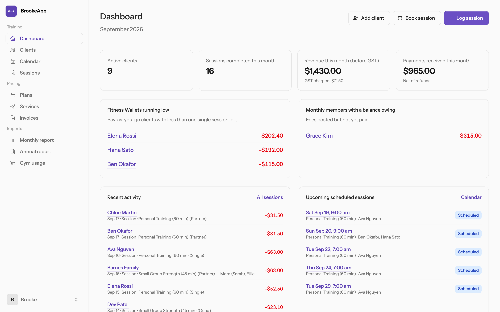

# BrookeApp

Billing and **Fitness Wallet** tracking for personal trainers: clients, sessions, invoices, GST and gym usage in one place. Built with Laravel 13, Livewire 4 and Flux; requires PHP 8.5.

**Version 1.0.0**, released September 18, 2026. See [CHANGELOG.md](CHANGELOG.md). Free software under the [GNU AGPL v3](LICENSE).



Each trainer registers with an email and password and gets a private workspace: multi-tenant on one database, with every row scoped to its trainer. The trainer's clients never log in; each has a private wallet link instead.

## Contents

- [Features](#features)
- [Requirements](#requirements)
- [Quick start (local development)](#quick-start-local-development)
- [Configuration reference](#configuration-reference)
- [Self-hosting in production](#self-hosting-in-production)
- [Updating](#updating)
- [Security](#security)
- [Operations](#operations)
- [Best practices](#best-practices)
- [User guide](#user-guide)
- [Contributing](#contributing)
- [Maintainer](#maintainer)
- [License](#license)

## Features

- **Clients** on one of three kinds of plan:
  - **Pay-as-you-go (Fitness Wallet)**: the client deposits money and each completed session deducts a per-person rate plus GST.
  - **Family**: one client record for a household, up to ten named members sharing a single wallet. Each session charges for the members who attended.
  - **Monthly membership**: a flat fee plus GST posted to the client's ledger every month; every session is included.
- **Services** (e.g. "Personal Training (60 min)") and **Plans** holding a rate grid: Single, Partner, Triple and Quad prices per person, with an optional package size used to suggest payment requests. Clients can be on different plans; a one-off price override is available per attendee.
- **Sessions**: log who trained and the rate tier follows the group size. Each attendee is **Attended**, **Missed / late cancel** (charged at the booked group rate with a reason the client sees, not counted toward gym usage) or **No-show** (not charged). Sessions can be logged one at a time, in bulk for up to 50 dates, or from the calendar on a phone. Completed sessions can be reopened to fix attendance.
- **Calendar and booking**: month, week and day views on a time grid, a phone list view with a bottom sheet to log, edit or cancel, repeating bookings (every 1, 2 or 4 weeks, up to 12 months or 100 sessions), overlap warnings, and `.ics` calendar invites with automatic updates and cancellations.
- **Money**: payments by cash, cheque or e-Transfer; adjustments and refunds; ledger entries editable with a required reason and a full revision history; numbered **invoices** (payment requests) emailed to clients, reminded, marked paid, voided or deleted, and settled automatically by the payments linked to them.
- **GST**: rates are entered before tax and GST (5% by default) is added on top. Money received is GST-inclusive. Reports show GST on both an accrual and a cash basis.
- **Gyms**: up to three gyms per trainer, each billing a monthly rate, hourly usage by group size pro-rated to session length, or both. The gym usage report reconciles what the trainer owes, and **cover sessions** record the gym paying the trainer to train its own clients.
- **Reports**: monthly and annual (tax year) summaries with CSV export, and a per-gym monthly statement that can be finalized as a snapshot.
- **Client emails**: branded booking invites, updates, cancellations, receipts, invoices, reminders, thank-yous and wallet links, all queued.
- **Client wallet page**: a private, password-free page per client with balance, plan, how to pay, outstanding invoices, upcoming sessions and history, in list or calendar form.
- **User guide**: a twelve-chapter illustrated guide inside the app (user menu → Documentation) and as a printable PDF.
- **Platform administration**: an `/admin` area for the platform owner to support trainers without seeing their money.

BrookeApp was built for a trainer in British Columbia, so money is in dollars and tax is a single GST rate. Other regions with one sales tax on top of the price should work by changing the rate in Business settings.

## Requirements

| Component | Version | Notes |
|---|---|---|
| PHP | 8.5 | with the `ctype`, `curl`, `dom`, `fileinfo`, `filter`, `mbstring`, `openssl`, `session`, `tokenizer`, `xml` and `pdo_sqlite` or `pdo_mysql` extensions |
| Composer | 2.x | |
| Node.js | 22 or newer | only to build the Tailwind and Livewire assets with Vite; nothing runs on Node in production |
| Database | SQLite 3 (development) or MySQL 8 (production) | |
| Mail | any SMTP server locally; [Resend](https://resend.com) or any SMTP provider in production | every client email is queued |
| Production only | a web server (nginx or Apache) with PHP-FPM, a process supervisor (Supervisor or systemd) for the queue worker, and cron for the scheduler | |

There is no Docker setup; BrookeApp runs anywhere a normal Laravel application does.

## Quick start (local development)

Install PHP 8.5, Composer and Node.js 22 first.

- **macOS** with [Homebrew](https://brew.sh): `brew install php composer node`
- **Ubuntu or Debian**: PHP 8.5 from the [ondrej/php PPA](https://launchpad.net/~ondrej/+archive/ubuntu/php) (see [the production steps](#1-install-the-packages) for the package list), Composer from [getcomposer.org](https://getcomposer.org/download/), and Node.js from [NodeSource](https://github.com/nodesource/distributions).
- **Windows**: use [WSL](https://learn.microsoft.com/windows/wsl/install) and follow the Ubuntu instructions, or [Laravel Herd](https://herd.laravel.com).

Then:

```bash
git clone https://github.com/tyrelb/brookeapp.git
cd brookeapp
cp .env.example .env          # SQLite by default
composer install
php artisan key:generate
npm ci && npm run build
touch database/database.sqlite
php artisan migrate --seed    # demo data, see below
composer run dev              # http://localhost:8000
```

`composer run dev` starts the web server, a queue listener, the log tail and Vite together: queued emails send straight away and CSS changes appear without a rebuild. `php artisan serve` on its own also works.

### Demo accounts

The seeder creates a trainer with a few months of clients, sessions, payments and invoices. Every account's password is `password`.

| Email | What it is |
|---|---|
| `brooke@example.com` | the demo trainer |
| `other@example.com` | a second trainer, to confirm trainers never see each other's data |
| `admin@example.com` | a platform administrator |

The seeder refuses to run when `APP_ENV=production`.

### Email in development

Outbound email (registration verification, password resets, every client email) goes to SMTP on `127.0.0.1:1025` by default, which is where [Mailpit](https://mailpit.axllent.org) (`brew install mailpit && brew services start mailpit`) and [MailHog](https://github.com/mailhog/MailHog) listen. Open http://127.0.0.1:8025 to read it. Set `MAIL_MAILER=log` in `.env` to write mail to `storage/logs/laravel.log` instead.

Client emails are queued. With `QUEUE_CONNECTION=database` (the default) run `php artisan queue:work` or use `composer run dev`; set `QUEUE_CONNECTION=sync` to send inline while developing.

### Using MySQL locally

Uncomment the `DB_CONNECTION=mysql` block in `.env`, create the database, and run `php artisan migrate --seed`. Nothing else changes.

### Tests and code style

```bash
vendor/bin/pest          # feature and unit tests, on an in-memory SQLite database
vendor/bin/pint --test   # code style
```

CI runs both on pushes and pull requests to `main` and `develop`.

## Configuration reference

Everything is set in `.env`. After changing it on a server, run `php artisan optimize` and `php artisan queue:restart` so the web server and the queue worker both pick it up.

| Key | Purpose |
|---|---|
| `APP_ENV`, `APP_DEBUG` | `production` and `false` on a live site. Debug mode shows stack traces and configuration to anyone who triggers an error. |
| `APP_URL` | Every link in a client email and every wallet link is built from this, including from the queue worker. Set it to the public `https://` address. |
| `APP_TIMEZONE` | `America/Vancouver` by default. Session times display in it. |
| `REGISTRATION_ENABLED` | `true` (the default) lets anyone sign up as a trainer. Set `false` on a private install once your accounts exist; existing trainers can still log in. |
| `DB_CONNECTION` | `sqlite` for development, `mysql` for production, with the `DB_*` keys below it. |
| `QUEUE_CONNECTION` | `database` needs a worker; `sync` sends emails during the request. |
| `MAIL_MAILER` | `smtp` (Mailpit locally or any provider), `resend` with `RESEND_API_KEY`, or `log` for development only: it writes wallet and password-reset links into the log file. |
| `MAIL_FROM_ADDRESS`, `MAIL_FROM_NAME` | The sender of every email. With Resend it must be on a verified domain. Client emails show the trainer's business name and set Reply-To to the trainer's own address. |
| `SESSION_SECURE_COOKIE` | `true` in production so the login cookie is only sent over HTTPS. |
| `LOG_LEVEL` | `debug` locally; `warning` or `error` in production. |

## Self-hosting in production

These steps set up one server running Ubuntu 24.04 with nginx, PHP-FPM 8.5, MySQL 8, Supervisor and cron. Replace `brooke.example.com` with your domain, and point its DNS at the server first. Run them as a user with `sudo`.

### 1. Install the packages

```bash
sudo add-apt-repository ppa:ondrej/php
curl -fsSL https://deb.nodesource.com/setup_22.x | sudo -E bash -
sudo apt update
sudo apt install -y nginx mysql-server supervisor git unzip nodejs \
  php8.5-fpm php8.5-cli php8.5-mysql php8.5-mbstring php8.5-xml php8.5-curl php8.5-intl php8.5-zip php8.5-bcmath
curl -sS https://getcomposer.org/installer | sudo php -- --install-dir=/usr/local/bin --filename=composer
```

### 2. Create the database

```bash
sudo mysql
```

```sql
CREATE DATABASE brookeapp CHARACTER SET utf8mb4 COLLATE utf8mb4_unicode_ci;
CREATE USER 'brookeapp'@'localhost' IDENTIFIED BY 'a-long-random-password';
GRANT ALL PRIVILEGES ON brookeapp.* TO 'brookeapp'@'localhost';
```

### 3. Create an app user and run PHP as it

The web server, queue worker and scheduler all run as one user that owns the code, so file permissions never get in the way. If this server hosts only BrookeApp, the simplest way is to run the default PHP-FPM pool as that user:

```bash
sudo adduser --disabled-password --gecos "" brookeapp
sudo mkdir -p /var/www/brookeapp && sudo chown brookeapp:brookeapp /var/www/brookeapp
sudo sed -i 's/^user = www-data/user = brookeapp/; s/^group = www-data/group = brookeapp/' /etc/php/8.5/fpm/pool.d/www.conf
sudo systemctl restart php8.5-fpm
```

The socket stays owned by `www-data`, so nginx can still reach it. On a shared server, create a separate pool in `/etc/php/8.5/fpm/pool.d/` instead.

### 4. Install the app

```bash
sudo -iu brookeapp
git clone https://github.com/tyrelb/brookeapp.git /var/www/brookeapp
cd /var/www/brookeapp
cp .env.example .env
```

Edit `.env` and set at least:

```ini
APP_ENV=production
APP_DEBUG=false
APP_URL=https://brooke.example.com
APP_TIMEZONE=America/Vancouver
LOG_LEVEL=warning
REGISTRATION_ENABLED=true

DB_CONNECTION=mysql
DB_HOST=127.0.0.1
DB_PORT=3306
DB_DATABASE=brookeapp
DB_USERNAME=brookeapp
DB_PASSWORD=a-long-random-password

SESSION_SECURE_COOKIE=true

MAIL_MAILER=resend
RESEND_API_KEY=re_...
MAIL_FROM_ADDRESS="billing@example.com"
```

To use another provider over SMTP, set `MAIL_MAILER=smtp` with its `MAIL_HOST`, `MAIL_PORT`, `MAIL_USERNAME`, `MAIL_PASSWORD` and `MAIL_SCHEME`. Email verification is required before a new trainer's dashboard opens, so mail must work before the first sign-up.

Then build and migrate:

```bash
composer install --no-dev --optimize-autoloader
php artisan key:generate
npm ci && npm run build
php artisan migrate --force
php artisan optimize
exit
```

Never run `php artisan db:seed` or `migrate --seed` here. The demo accounts all have the password `password`, including an administrator; the seeder refuses to run in production for that reason.

### 5. Configure nginx

Create `/etc/nginx/sites-available/brookeapp`:

```nginx
server {
    listen 80;
    listen [::]:80;
    server_name brooke.example.com;
    root /var/www/brookeapp/public;

    index index.php;
    charset utf-8;

    location / {
        try_files $uri $uri/ /index.php?$query_string;
    }

    location = /favicon.ico { access_log off; log_not_found off; }
    location = /robots.txt  { access_log off; log_not_found off; }

    error_page 404 /index.php;

    location ~ ^/index\.php(/|$) {
        fastcgi_pass unix:/run/php/php8.5-fpm.sock;
        fastcgi_param SCRIPT_FILENAME $realpath_root$fastcgi_script_name;
        include fastcgi_params;
        fastcgi_hide_header X-Powered-By;
    }

    location ~ /\.(?!well-known).* {
        deny all;
    }
}
```

```bash
sudo ln -s /etc/nginx/sites-available/brookeapp /etc/nginx/sites-enabled/
sudo rm -f /etc/nginx/sites-enabled/default
sudo nginx -t && sudo systemctl reload nginx
```

### 6. Turn on HTTPS

```bash
sudo apt install -y certbot python3-certbot-nginx
sudo certbot --nginx -d brooke.example.com --redirect
```

Certbot adds the certificate, redirects HTTP to HTTPS and renews itself. Once HTTPS works, add HSTS to the `listen 443` server block certbot created, then reload nginx:

```nginx
add_header Strict-Transport-Security "max-age=31536000" always;
```

The app sends its own `X-Frame-Options`, `X-Content-Type-Options`, `Referrer-Policy` and `Permissions-Policy` headers.

### 7. Run the queue worker

Every client email is queued, so without a worker no email is ever sent. Create `/etc/supervisor/conf.d/brookeapp-queue.conf`:

```ini
[program:brookeapp-queue]
command=php /var/www/brookeapp/artisan queue:work --tries=3 --max-time=3600
user=brookeapp
autostart=true
autorestart=true
stopwaitsecs=60
redirect_stderr=true
stdout_logfile=/var/www/brookeapp/storage/logs/queue.log
```

```bash
sudo supervisorctl reread && sudo supervisorctl update
sudo supervisorctl status brookeapp-queue
```

### 8. Schedule monthly fees

The scheduler posts monthly membership fees each morning. Add it to the app user's crontab with `sudo crontab -u brookeapp -e`:

```cron
* * * * * cd /var/www/brookeapp && php artisan schedule:run >> /dev/null 2>&1
```

### 9. Create your administrator

Open `https://brooke.example.com`, register, and click the link in the verification email. Then make that account an administrator:

```bash
sudo -iu brookeapp php /var/www/brookeapp/artisan admin:grant you@example.com
```

For a private install, set `REGISTRATION_ENABLED=false` in `.env` once every trainer who needs an account has one, and run `php artisan optimize`.

### 10. Back up the database

Balances, invoices and history all live in MySQL; there are no uploaded files. A nightly dump kept for a month is a good minimum:

```bash
sudo mkdir -p /var/backups/brookeapp && sudo chown brookeapp /var/backups/brookeapp
printf '[mysqldump]\nuser=brookeapp\npassword=a-long-random-password\n' | sudo -u brookeapp tee /home/brookeapp/.my.cnf >/dev/null
sudo chmod 600 /home/brookeapp/.my.cnf
```

Then add to the app user's crontab:

```cron
30 2 * * * mysqldump --single-transaction brookeapp | gzip > /var/backups/brookeapp/brookeapp-$(date +\%F).sql.gz && find /var/backups/brookeapp -name '*.sql.gz' -mtime +30 -delete
```

Copy the dumps off the server, and keep a copy of `.env` somewhere safe too.

### Behind a proxy or load balancer

If TLS ends at a load balancer, Cloudflare or another proxy in front of the server, the app sees every request as coming from the proxy. Links may be generated with `http://`, and the login throttle counts every visitor as one address. Tell Laravel to trust the proxy in `bootstrap/app.php`, using its address range rather than `*` unless the server is reachable only through the proxy:

```php
->withMiddleware(function (Middleware $middleware): void {
    $middleware->trustProxies(at: ['10.0.0.0/8']);
    // ...
})
```

### Laravel Forge

On [Laravel Forge](https://forge.laravel.com) the same setup is a few clicks:

1. Create a site with PHP 8.5 and a MySQL 8 database, pointed at your fork's branch, and install a Let's Encrypt certificate.
2. Fill in the site's environment with the `.env` values above, including a real `APP_KEY` (`php artisan key:generate --show`).
3. Use this deploy script:

   ```bash
   composer install --no-dev --optimize-autoloader
   npm ci && npm run build
   php artisan migrate --force
   php artisan optimize
   php artisan queue:restart
   ```

4. Enable the **scheduler**, add a **queue worker** (`queue:work --tries=3`), and turn on daily **database backups**.
5. Grant yourself admin with `php artisan admin:grant you@example.com` from the site's Commands tab.

## Updating

Back up the database first, then, as the app user:

```bash
cd /var/www/brookeapp
git pull
composer install --no-dev --optimize-autoloader
npm ci && npm run build
php artisan migrate --force
php artisan optimize
php artisan queue:restart
```

`queue:restart` makes the worker pick up new code and `.env` changes. `php artisan optimize` caches the configuration, so run it again after every `.env` edit; a server reboot does not clear the cache on its own. Check [CHANGELOG.md](CHANGELOG.md) for anything a release asks you to do.

To confirm an update landed without logging in, request a page that only exists in the new code. An authenticated route answers `302` to `/login` once deployed and `404` before.

## Security

### How BrookeApp protects data

- **Tenancy.** Every trainer-owned table carries a `user_id`, and a global scope limits every query to the logged-in trainer. Policies check ownership again before every change. `tests/Feature/TenantIsolationTest.php` logs in as one trainer and tries to reach another's records.
- **Wallet links.** A client's link holds a 48-character random token. The page is rate limited, never cached, marked `noindex`, and sends no referrer. The trainer can reset the link at any time, and every link stops working while the trainer is suspended. Web server access logs contain these links, so treat the logs as private.
- **Administrators** see account status and activity counts only; trainers' clients, ledgers, payments and reports are never shown to them.
- **Suspension** takes effect at the trainer's next click, and suspended accounts cannot log in.
- **Client emails** come from your address with the trainer's name. Links and images a trainer types into their settings, notes or invoice messages arrive as plain text, so emails can't carry hidden links.
- **Sign-ups** can be closed with `REGISTRATION_ENABLED=false`. Registration, login and verification emails are rate limited.

### Production checklist

- [ ] `APP_ENV=production`, `APP_DEBUG=false`, and a unique `APP_KEY`.
- [ ] HTTPS only, with HSTS and `SESSION_SECURE_COOKIE=true`.
- [ ] A real mailer. Never use `MAIL_MAILER=log`, which writes wallet and password-reset links to the log.
- [ ] The database was never seeded with the demo accounts.
- [ ] `REGISTRATION_ENABLED=false` if the install is only for you or your team.
- [ ] The queue worker and scheduler are running, and database backups are copied off the server.
- [ ] Trusted proxies are configured if a proxy or load balancer sits in front.

### Reporting a vulnerability

Please email [tb@tyrel.ca](mailto:tb@tyrel.ca) rather than opening a public issue. See [SECURITY.md](SECURITY.md).

## Operations

- **Monthly fees** post automatically each morning (Pacific time) for every active monthly member whose billing day has arrived. Posting is idempotent per client and month, and **Post monthly fee** on the client page is a manual fallback.

  ```bash
  php artisan billing:post-monthly-fees               # run now
  php artisan billing:post-monthly-fees --date=2026-10-01
  ```

- **Administrators** are granted with `php artisan admin:grant email` (add `--revoke` to remove) or from the Trainers page in `/admin`.
- **Suspending a trainer** (from `/admin`) logs them out, blocks logins and disables their clients' wallet links until reinstated. Data is kept.
- **Logs** are in `storage/logs/laravel.log`, and the worker's output is in `storage/logs/queue.log`. Failed queue jobs land in the `failed_jobs` table; `php artisan queue:retry all` re-sends them.

## Best practices

### For the trainer

- **Set up in this order**: Business settings, gyms, services, plans, then clients. Each step feeds the next, and it is the order the in-app guide follows.
- **Start from today.** Do not enter history. Record each client's current balance as one deposit and let the app track everything from there.
- **Log the same day.** Sessions can be logged later, and in bulk, but same-day logging keeps wallet balances and the "running low" list honest.
- **Use the attendance choices, not overrides, for cancellations.** Missed / late cancel charges the client without billing you for gym space nobody used; No-show charges nothing. Overrides are for one-off prices.
- **Correct, do not delete.** Reopen a session to fix attendance; edit a ledger entry with a reason rather than voiding and retyping. Every change is recorded, so the ledger can always be explained.
- **Reconcile the gym monthly.** Compare the gym usage report with the gym's invoice, untick anything the gym did not charge for, then Finalize. The snapshot protects the month from later edits.
- **Use invoices to ask for money.** Request payment suggests the right amount from the plan, emails the client, and settles itself when the payment is recorded against it.
- **Send the wallet link, not statements.** Clients can see their own balance and history any time. Reset the link if it is forwarded.
- **Ask your accountant which GST basis to remit on.** The monthly and annual reports show both; prepaid deposits are why they differ.

### For the operator

- **Never use demo credentials in production.** The seeder is for local databases only; production accounts are created through registration.
- **Keep `APP_URL` correct.** Wallet links and email images are built from it, including by the queue worker. After changing it, run `php artisan optimize` and `php artisan queue:restart`.
- **Watch the queue.** Client emails are the product's main outbound channel. Alert on a stopped worker and on rows in `failed_jobs`.
- **Back up before migrating.** Updates run migrations; a backup taken just before makes a rollback a restore rather than a rewrite.
- **Do not edit ledger rows in the database.** Balances are sums of the ledger, invoices derive paid status from linked payments, and gym months are snapshots. Change money through the app so the history is written.
- **Update the user guide with the feature.** Chapters live in `resources/docs/`; recapture screenshots and rebuild the PDF (below) in the same change so the documentation never trails the release.

## User guide

Logged-in trainers get a **Documentation** entry in the user menu (bottom of the sidebar) that opens a step-by-step guide with screenshots, plus a **Download PDF** button. The guide is written for the trainer, not for developers, and shows the version from the `VERSION` file.

- Chapters are Markdown in `resources/docs/`, listed in order by `resources/docs/manifest.php`. They render in-app through `App\Support\UserGuide` at `/docs/{chapter}`; the `platform-admin` chapter is only shown to administrators.
- Screenshots live in `public/images/docs/` and are captured from the seeded demo trainer by `scripts/docs/screenshots.sh`, which drives the [gstack](https://github.com/garrytan/gstack) headless browser. Point `DOCS_BASE_URL` at a local server running the seeded database (`php artisan migrate:fresh --seed` first). The script sends invites, reopens a session, finalizes a gym month and registers then deletes a throwaway account, so only run it against a demo database.
- The PDF at `resources/docs/BrookeApp-User-Guide.pdf` is built by `scripts/docs/build-pdf.sh` (gstack `make-pdf`; cover, Contents with page numbers, Letter size) and committed, then served behind login at `/docs/download`.

After editing a chapter, rebuild the PDF and commit both. `tests/Feature/DocsTest.php` fails if a chapter refers to a screenshot that does not exist or if the PDF is missing.

## Contributing

Issues and pull requests are welcome. For anything larger than a fix, open an issue first so we can agree on the approach.

- Run `vendor/bin/pest` and `vendor/bin/pint --test` before opening a pull request; CI runs both.
- Add or update tests with the change. Anything that touches money should show the ledger entries it writes.
- If the change is visible to trainers, update the user guide in the same pull request (see above).
- Report security problems privately, as described in [SECURITY.md](SECURITY.md).

### Releasing a version

1. Update `VERSION` and `config/app.php`'s `released` date, and move the Unreleased notes in `CHANGELOG.md` under the new version.
2. Recapture screenshots and rebuild the PDF so the guide shows the release.
3. Run `vendor/bin/pest` and `vendor/bin/pint --test`.
4. Commit, tag (`git tag v1.0.0`) and push.

## Maintainer

Tyrel Burton, [tb@tyrel.ca](mailto:tb@tyrel.ca)

## License

Copyright (C) 2026 Tyrel Burton

BrookeApp is free software: you can redistribute it and/or modify it under the terms of the [GNU Affero General Public License](LICENSE) as published by the Free Software Foundation, either version 3 of the License, or (at your option) any later version. It is distributed in the hope that it will be useful, but WITHOUT ANY WARRANTY; without even the implied warranty of MERCHANTABILITY or FITNESS FOR A PARTICULAR PURPOSE.

In short: you can use, change and host it, including commercially. If you run a modified version that other people use over a network, you must offer those users the source code of your version under the same licence.
